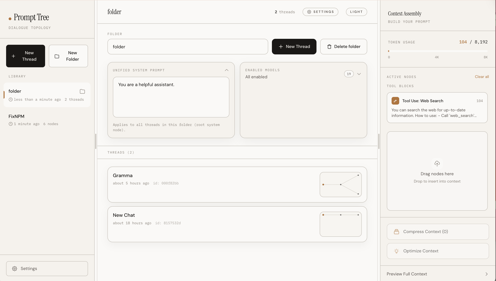
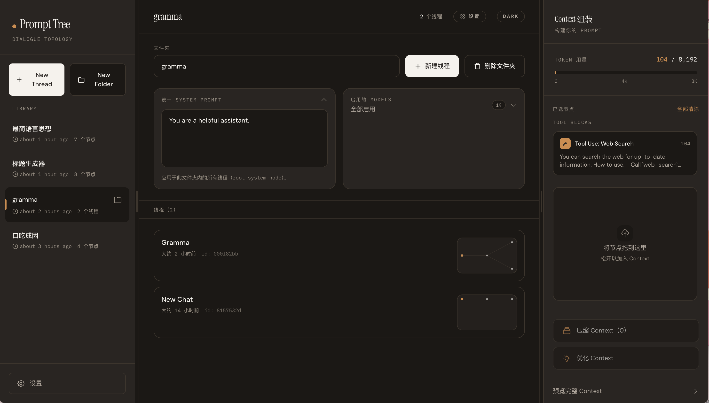
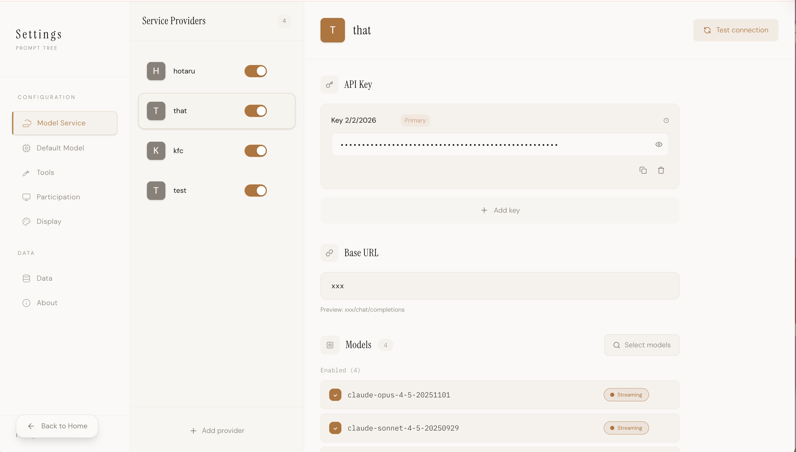
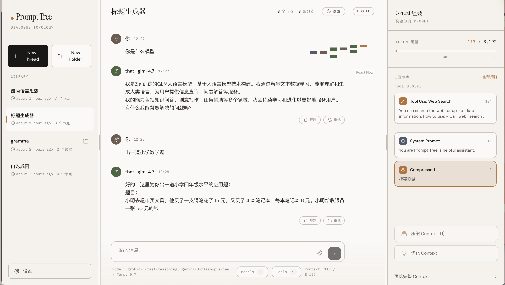
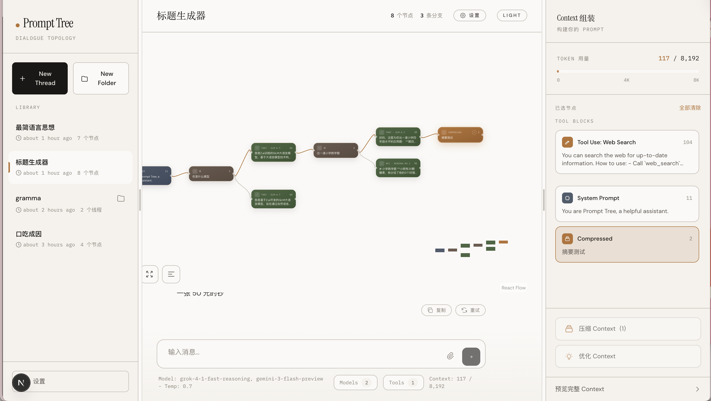
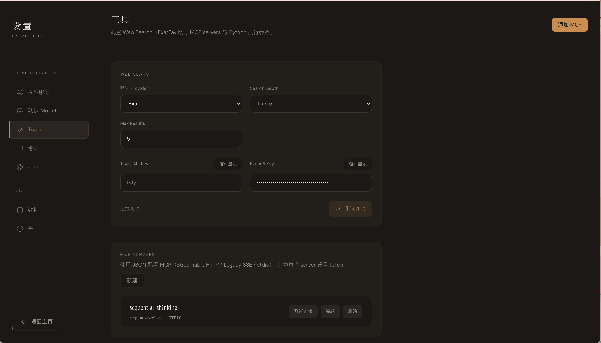

# Prompt Tree

<p align="center">
  <strong>English</strong> · <a href="./README.zh-CN.md">中文</a>
</p>

<p align="center">
  
  
  
  
  
</p>

Prompt Tree is a **local-first AI chat client** that models each conversation as a **node-based DAG (a tree with branches)** and provides an explicit **Context Box** for prompt assembly.

## Motivation

Most chat UIs are linear:

- Exploring alternatives means copy/paste, losing context, or starting over.
- Long threads are hard to navigate and expensive in tokens.
- “Context management” is implicit, fragile, and hard to audit.

Prompt Tree turns a conversation into a **canvas** you can branch, compress, and curate.

## Key Features

- **Conversation DAG (tree + branches)**: continue from any node and compare outcomes.
- **Canvas + chat in one place**: visualize the thread while you talk.
- **Context Box**: drag nodes into a curated context, reorder, preview, and track tokens.
- **Long-term memory (3-layer)**:
  - **User Profile (JSON → derived Markdown)**: persistent preferences/identity, fully visible & editable in Settings.
  - **Memory Bank (items)**: atomic memories with tags, status, confidence, and sources; supports user/folder scope.
  - **Folder Doc (JSON → derived Markdown)**: per-folder long-term doc, visible & editable in the folder page.
  - **First-message base injection + per-message memory refresh**: on a thread’s first user message, inject Profile/Folder Doc + initial `topK(folder) + topK(user)` memories; on every user message, refresh auto memory hits in the Context Box.
  - **Recent messages continuity (optional)**: on a thread’s first user message, copy the last N messages from your most recent thread (same folder) into the Context Box.
  - **Async memory writer**: runs on every user message; reads system prompt + all USER messages + a live memory snapshot resolved at execution time; can patch Profile/Folder Doc and upsert memories (first message can be forced to write at least 1 memory).
  - **`search_memory` tool + pin**: the model can search the full memory library during the tool loop; retrieved memories are added into the Context Box and can be pinned; per-thread caps are enforced (pinned wins over auto).
  - **Embeddings (optional)**: embedding model is configurable; lexical fallback is used when embeddings are disabled/unavailable.
- **Multi-model branching**: select multiple models and send once to get parallel branches.
- **Compression**: compress a selected chain (or the Context Box) into a compact node; decompress when needed.
- **Tools (optional)**: Web Search (Tavily/Exa), MCP servers, local Python execution.
- **Local-first storage**: conversations in IndexedDB; settings (providers/tools) in localStorage.

## Install

### Prerequisites

- Node.js 18+

### Install (npm / pnpm)

```bash
npm i -g @yxp934/prompt-tree
# or
pnpm add -g @yxp934/prompt-tree
```

### Update

```bash
npm i -g @yxp934/prompt-tree@latest
# or
pnpm up -g @yxp934/prompt-tree
```

### Uninstall

```bash
npm rm -g @yxp934/prompt-tree
# or
pnpm rm -g @yxp934/prompt-tree
```

## Run

Start the app:

```bash
tree
```

Open: `http://localhost:1666`

### Change the port

```bash
tree --port 7777
```

### CLI help / version

```bash
tree --help
tree --version
```

### Run without installing globally (optional)

Useful if your system already has a `tree` command:

```bash
npx -y --package @yxp934/prompt-tree tree
# or
pnpm dlx --package @yxp934/prompt-tree tree
```

## Usage Guide

### 1) Create folders & threads

- Create a folder (Library) to group threads.
- Optionally set a **Unified System Prompt** for the folder (applies to every new thread in that folder).




### 2) Configure providers (Model Service)

In `Settings → Model Service`:

- Add a provider
- Add one or more API keys (set a primary key)
- Set Base URL (OpenAI-compatible)
- Fetch/enable models and test connection

### 3) Select default models

In `Settings → Default Model`:

- Pick one or more enabled models (sending one message creates parallel branches)
- Pick a compression model (for summaries/meta instructions)
- Pick a title model (for thread titles)



### 4) Chat + branches

- Send a message once; if multiple models are selected, you’ll get multiple assistant branches.
- Use the branch list to switch, or continue from any node.



### 5) Navigate on the canvas

- The canvas shows the node graph of the current thread.
- Common actions: continue from here, compress branch, decompress, edit node, delete subtree.



### 6) Context Box (prompt assembly)

- Open the Context panel from the top bar.
- Drag nodes from the canvas into the Context Box.
- Reorder items, preview the compiled context, and track token usage.
- Compress either the whole context or a selected chain (must be a single continuous path).

### 7) Long-term memory (Profile / Memory Bank / Folder Doc)

- Configure in `Settings → Memory`:
  - Toggle long-term memory, auto-inject on first message, **auto-add recent messages (last N)**, and the `search_memory` tool.
  - When auto-add recent messages is enabled, a new thread’s first user message will copy the last N messages from your most recent thread (same folder) into the Context Box.
  - In the chat composer `Tools` menu, you can toggle `search_memory` per message (default enabled on new installs). When enabled, it appears in the Context Box as a **Tool Block** and is included in **Context Preview**.
  - Pick **Memory Writer model** and (optional) **Embedding model**.
  - Edit/view **User Profile JSON** and its derived Markdown.
  - Browse/edit/delete/restore memories; optionally re-embed memories when you change embedding model.
- In folder threads:
  - Configure the **first-message RAG ratio** (`topKFolder/topKUser`) in the folder page.
  - Edit/view **Folder Doc JSON** and manage **folder-scoped memories**.

### 8) Tools (Web Search / MCP / Python)

In `Settings → Tools`, configure:

- Web Search: Tavily / Exa API keys
- MCP: add server JSON + token
- Python: python command, timeouts, output limits



## Privacy & Data (based on current code)

- **Conversations** are stored locally in your browser’s IndexedDB database: `AIChatClientDB`.
- **Long-term memory artifacts** (User Profile / Folder Docs / Memory Bank + optional embeddings) are stored locally in the same IndexedDB database.
- **Providers, API keys, and tool settings** are stored locally in `localStorage` (keys prefixed with `prompt-tree.*`).
- The app runs locally; when you generate responses or use tools, requests are sent only to the model/tool endpoints you configure (this repo contains no built-in analytics/telemetry code).
- If you enable **Memory Writer** or **Embeddings**, the app will call the configured model endpoints for those operations.
- If you enable the **Python tool**, it executes code by spawning a local Python process on your machine—enable it only if you understand the risk.

## Development

```bash
cd ai-chat-client
npm install
npm run dev
```

Open: `http://localhost:1666`

Useful scripts:

```bash
npm run build
npm run start
npm run test
npm run lint
npm run typecheck
```

## Docs

- Product: [需求文档](./ai-chat-client/docs/需求文档.md)
- Technical design: [TECHNICAL_DESIGN](./ai-chat-client/docs/TECHNICAL_DESIGN.md)
- API design: [API_DESIGN](./ai-chat-client/docs/API_DESIGN.md)
- Roadmap: [ROADMAP](./ai-chat-client/docs/ROADMAP.md)

## Changelog

### 0.6.6 (2026-02-06)

- Default Model settings: add an adjustable **Prompt optimizer model** selector.
- Prompt optimization request routing: now prioritizes the configured optimizer model; falls back to selected chat model, then chat default model.

### 0.6.5 (2026-02-06)

- Chat input: add one-click prompt optimization with loading state, cancel, undo replace, empty-input disable, and anti-concurrency guard.
- Settings: add editable optimizer prompt (plain text, no variable placeholders) and a Smart Memory toggle.
- Smart Memory for optimizer: when enabled, optimization requests include user profile, folder profile (if in folder), top 10 RAG atomic memories, and context snapshot.
- Prompt optimizer default prompt: switch to English and enforce output language based on input language while keeping technical terms/code as needed.

### 0.6.4 (2026-02-06)

- Provider settings: fix Base URL input behavior so `/` is no longer removed while typing; normalization now happens on blur/submit checks.

### 0.6.3 (2026-02-06)

- Memory: refresh auto memory RAG blocks on every user message instead of first-message-only injection.
- Memory Writer: build memory snapshot at job execution time from latest memory state to reduce duplicate/conflicting writes.

### 0.6.2 (2026-02-06)

- Memory: add “Auto-add recent messages” (last N) on a thread’s first user message to keep continuity across threads (in parallel with long-term memory injection).

## Contact

- Email: yxp934@outlook.com
- WeChat: WanguA8

## License

MIT
